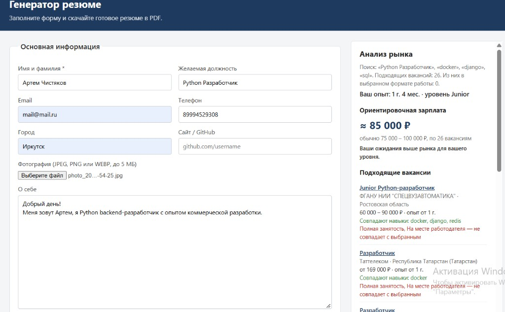
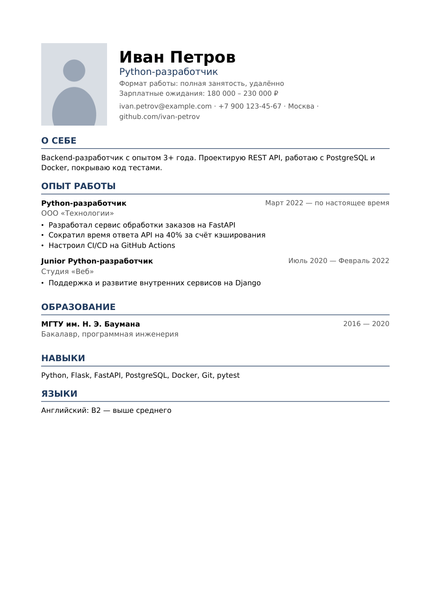

Ссылка на презентацию работы программы - https://youtu.be/wZwSSOlZ2j8


# Генератор резюме

Веб-приложение на Python (Flask) для создания резюме в формате PDF. Пользователь заполняет форму — контакты, опыт работы, образование, навыки, загружает фотографию — и получает готовый PDF-файл для отправки работодателям.

### Интерфейс

Слева — форма резюме, справа — анализ рынка: ориентировочная зарплата и подходящие вакансии, которые обновляются по мере заполнения формы.



### Пример готового резюме




## Возможности

- Форма с основными разделами резюме: контакты, «О себе», опыт работы, образование, навыки
- Выбор формата работы галочками (полная/частичная занятость, удалённо и т.д.)
  и уровня английского из списка, зарплатные ожидания «от — до»
- Даты опыта работы выбираются в календаре, есть отметка «По настоящее время»
- Динамическое добавление и удаление мест работы и учебных заведений
- Блоки резюме не разрываются между страницами, заголовок раздела переносится вместе с первой записью
- **Анализ рынка в реальном времени**: по мере заполнения формы справа показываются
  ориентировочная зарплата и ссылки на подходящие вакансии


## Анализ рынка

Данные берутся из открытого API портала [«Работа России»](https://trudvsem.ru)
(ключ доступа не нужен).

1. **Поиск.** Параллельно выполняются запросы по желаемой должности (или последней должности из опыта) и по трём первым навыкам; результаты объединяются без дублей.
2. **Уровень кандидата.** Суммарный стаж считается по периодам работы с учётом пересечений и переводится в уровень: до 1 года — стажёр, 1–3 года — Junior, 3–6 — Middle, от 6 — Senior.
3. **Подбор вакансий.** Вакансия подходит, если совпадает название должности **или** в её требованиях есть хотя бы 2 навыка кандидата. Вакансии, требующие заметно больше опыта, отбрасываются. Остальные ранжируются по числу совпавших навыков, названию, уровню в названии вакансии, требуемому опыту, региону, пересечению с зарплатными ожиданиями и формату работы. Формат сравнивается по двум независимым признакам — место работы (удалённо / на месте) и занятость (полная / частичная / подработка).
4. **Зарплата.** Медиана и межквартильный диапазон по вакансиям уровня кандидата;
   зарплатные ожидания сравниваются с этим диапазоном.

Ответ API занимает 10–15 секунд, поэтому результаты кэшируются на 10 минут: при правке навыков или опыта панель обновляется мгновенно. 


## Стек

- **Backend:** Python 3.11+, Flask
- **PDF:** ReportLab
- **Изображения:** Pillow
- **Вакансии:** requests + открытый API trudvsem.ru
- **Frontend:** HTML (Jinja2), CSS, немного JavaScript без фреймворков
- **Качество кода:** pytest, ruff, GitHub Actions


## Структура проекта

```
resume/
├── app/
│   ├── __init__.py          # фабрика приложения create_app()
│   ├── config.py            # настройки (лимит загрузки и т.д.)
│   ├── choices.py           # варианты выбора: формат работы, уровни английского
│   ├── models.py            # dataclass-модели: Resume, Experience, Education
│   ├── routes.py            # HTTP-маршруты: форма, генерация PDF, API анализа рынка
│   ├── services/
│   │   ├── form_parser.py   # разбор и валидация данных формы
│   │   ├── photo.py         # проверка и обработка фотографии
│   │   ├── pdf_generator.py # вёрстка PDF
│   │   ├── career.py        # подсчёт стажа и уровня кандидата
│   │   ├── job_market.py    # подбор вакансий и оценка зарплаты
│   │   └── vacancy_sources/ # источники вакансий (API «Работа России»)
│   ├── assets/fonts/        # шрифты DejaVu для кириллицы в PDF
│   ├── templates/           # Jinja2-шаблоны
│   └── static/              # CSS и JS
├── tests/                   # тесты pytest
├── scripts/
│   └── generate_example.py  # генерация примера docs/example.pdf
├── docs/                    # пример резюме для README
├── .github/workflows/ci.yml # CI: линтер и тесты
├── run.py                   # точка входа
├── pyproject.toml           # метаданные проекта, настройки pytest и ruff
├── requirements.txt
└── requirements-dev.txt
```


## Запуск

```bash
git clone https://github.com/chstkvart/generate_resume.git
cd resume

python -m venv .venv
# Windows:
.venv\Scripts\activate
# Linux / macOS:
source .venv/bin/activate

pip install -r requirements.txt
python run.py
```

Откройте в браузере http://127.0.0.1:5000.

